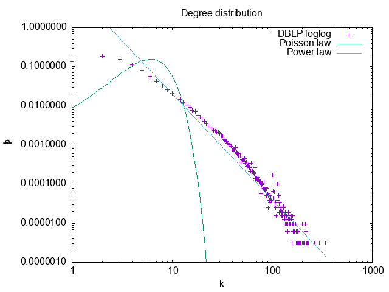
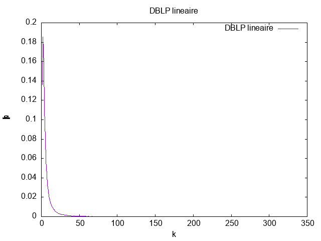
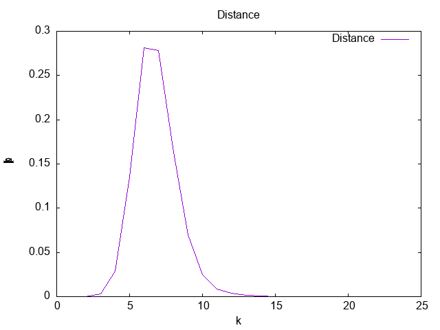
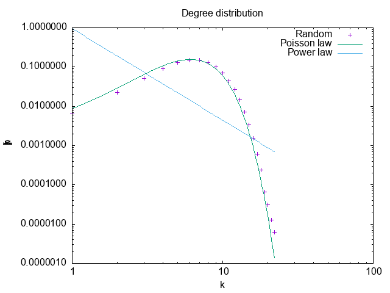
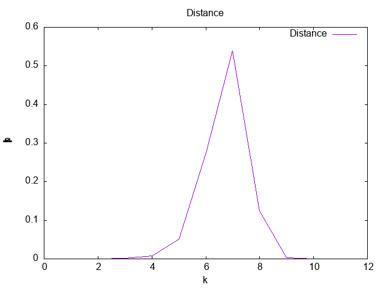
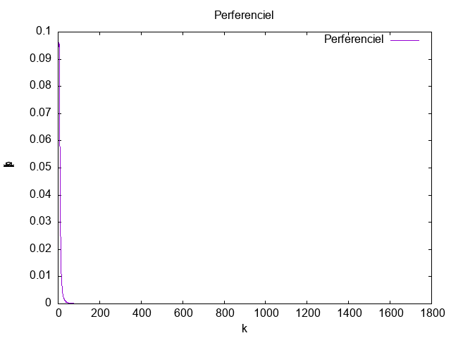
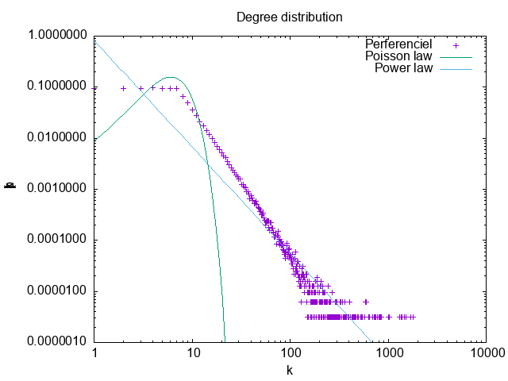
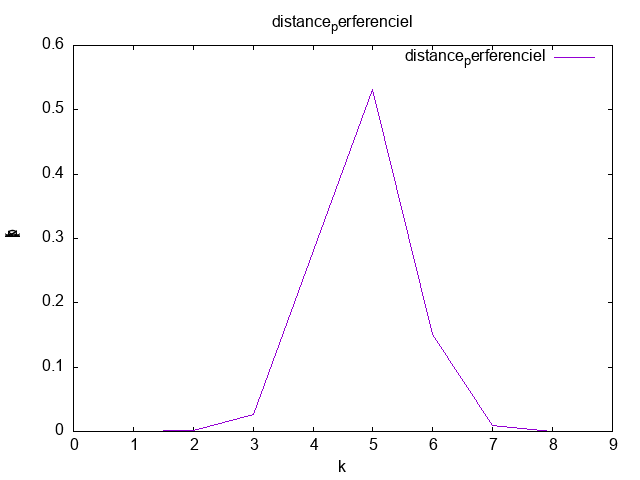

# MesuresRI OUATAR Hakim

# Mesures de réseaux d'interaction

Nous allons analyser un réseau de collaboration scientifique en informatique. Le réseau est extrait de DBLP et disponible sur [SNAP](https://snap.stanford.edu/data/com-DBLP.html).

GraphStream permet de mesurer de nombreuses caractéristiques d'un réseau. La plupart de ces mesures sont implantées comme des méthodes statiques dans la classe [`Toolkit`](https://data.graphstream-project.org/api/gs-algo/current/org/graphstream/algorithm/Toolkit.html). Elles vous seront très utiles par la suite.

1. Commencez par télécharger les données et les lire avec GraphStream. GraphStream sait lire ce format. Voir [`FileSourceEdge`](https://data.graphstream-project.org/api/gs-core/current/org/graphstream/stream/file/FileSourceEdge.html) et ce [tutoriel](http://graphstream-project.org/doc/Tutorials/Reading-files-using-FileSource/). Vous pouvez essayer de visualiser le graphe mais pour cette taille ça sera très lent et très peu parlant.
2. Prenez quelques mesures de base: nombre de nœuds et de liens, degré moyen, coefficient de clustering. Quel sera le coefficient de clustering pour un réseau aléatoire de la même taille et du même degré moyen ?

### Mesures de bases sur ce graphe    

|Mesures|Valeur|
|--|--|
*Nombre de noeuds* | *317080*|
*Nombres de liens* | *1049866*|
*Degré Moyen* | *6.62208890914917*|
*C-M-Clustering* | *0.6324308280637396*|


##### Réseau Aléatoire

Le degré moyen  d'un réseau aléatoire est de  (2 *L) / N = 6   
Le coefficient de clustering d'un réseau aléatoire  est Ci = p = <k>/N oû k est le degré ,    
le coeificient de clustring est C = k / N =  0.00002088

3. Le réseau est-il connexe ? Un réseau aléatoire de la même taille et degré moyen sera-t-il connexe ? À partir de quel degré moyen un réseau aléatoire avec cette taille devient connexe ?
   En utilisant la méthode isConnected de la classe Toolkit ,on trouve que le réseau est connexe . Un réseau aléatoire de la même taille et degré , on peut le vérifier en utilisant la  loi de regime connexe d'un réseau :  
 
   < k> > ln N (p > ln N/N)   
   ln N = ln(317080) = 12,6669    
   k = 6.62208890914917    
   k < ln N  donc ce réseau aléatoire n'est pas connexe     
   Un réseau aléatoire devient connexe à partir de <k> > ln N   
4.  Calculez la distribution des degrés et tracez-la avec `gnuplot` (ou avec votre outil préféré) d'abord en échelle linéaire, ensuite en échelle log-log. Est-ce qu'on observe une ligne droite en log-log ? Que cela nous indique ? Tracez la distribution de Poisson avec la même moyenne pour comparaison. Utilisez la commande `fit` de `gnuplot` pour trouver les coefficients de la loi de puissance et tracez-la.

La distribution de degrés $`p_k = \frac{N_k}{N}`$ est la probabilité qu'un nœud choisi au hasard ait degré $`k`$. On peut utiliser [`Toolkit.degreeDistribution()`](https://data.graphstream-project.org/api/gs-algo/current/org/graphstream/algorithm/Toolkit.html#degreeDistribution(org.graphstream.graph.Graph)) pour obtenir $`N_k`$ et normaliser par la suite :

 ```java
 int[] dd = Toolkit.degreeDistribution(graph);
 for (int k = 0; k < dd.length; k++) {
   if (dd[k] != 0) {
     System.out.printf(Locale.US, "%6d%20.8f%n", k, (double)dd[k] / graph.getNodeCount());
   }
 }
 ```

En traçant la distribution de degrés en échelle log-log on observe une ligne droite pendant plusieurs ordres de grandeur. Cela nous indique une loi de puissance :

 ```math
 p_k = C k^{-\gamma}
 ```
On utilise ce [script](./Result/DBLP/plot_dd_dblp_log.gnuplot) pour tracer la distribution et estimer l'exposant de la loi de puissance.     cd



On a $`\gamma = 2.7 \pm 0.04`$  
On utilise ce [script](./Result/DBLP/plot_dd_dblp_lin.gnuplot) pour tracer la distribution des degrés



5. Maintenant on va calculer la distance moyenne dans le réseau. Le calcul des plus courts chemins entre toutes les paires de nœuds prendra plusieurs heures pour cette taille de réseau. C'est pourquoi on va estimer la distance moyenne par échantillonnage en faisant un parcours en largeur à partir de 1000 sommets choisis au hasard. L'hypothèse des six degrés de séparation se confirme-t-elle ? Est-ce qu'il s'agit d'un réseau petit monde ? Quelle sera la distance moyenne dans un réseau aléatoire avec les mêmes caractéristiques ? Tracez également la *distribution* des distances. Formulez une hypothèse sur la loi de cette distribution.
   La distance maximale dmax = ln N / ln(k)  = 6,70 ,on la comparant à celle trouvé par notre programme qui 6,70 ,    
   ces deux résultats sont presque égaux et  ce résultat est une la propriété petit monde.
   Dans un réseau aléatoire de même taille et de même degrée :

   dmax = ln(317080)/ ln(6,62088) = 6,0700645


On utilise ce [script](./Result/DBLP/distance.gnuplot) pour tracer la distribution des distances

 

6. Utilisez les générateurs de GraphStream pour générer un réseau aléatoire et un réseau avec la méthode d'attachement préférentiel (Barabasi-Albert) qui ont la même taille et le même degré moyen. Refaites les mesures des questions précédentes pour ces deux réseaux. Les résultats expérimentaux correspondent-ils aux prédictions théoriques ? Comparez avec le réseau de collaboration. Que peut-on conclure ?


### Mesures de bases réseau aléatoire    :     

|Mesures|Valeur|
|--|--|
*Nombre de noeuds* | *317080*|
*Nombres de liens* | *1111102*|
*Degré Moyen* | *7.008161544799805*|
*C-M-Clustering* | *2.0129715699474017E-5*|

On utilise ce [script](./Result/Random/plot_random_lin.gnuplot) pour tracer la distribution des degrés à l'echelle linéaire.




On utilise ce [script](./Result/Random/plot_random_log.gnuplot) pour tracer la distribution  et estimer l'exposant de la loi de puissance .


Distance :

On utilise ce [script](./Result/Random/plot_disdes_random.gnuplot) pour tracer la distribution des distance

      

### Mesures de bases réseau perferenciel   

|Mesures|Valeur|
|--|--|
*Nombre de noeuds* | *317080*|
*Nombres de liens* | *1267922*|
*Degré Moyen* | *7.997439384460449*|
*C-M-Clustering* | *5.183135558762672E-4*|


On utilise ce [script](./Result/Perferenciel/plot_perferenciel_lin.gnuplot) pour tracer la distribution à l'échelle linéaire.




On utilise ce [script](./Result/Perferenciel/plot_perferenciel_log.gnuplot) pour tracer la distribution  et estimer l'exposant de la loi de puissance.




Distance     :   
On utilise ce [script](./Result/Perferenciel/distance.gnuplot) pour tracer la distribution  des distances .

    